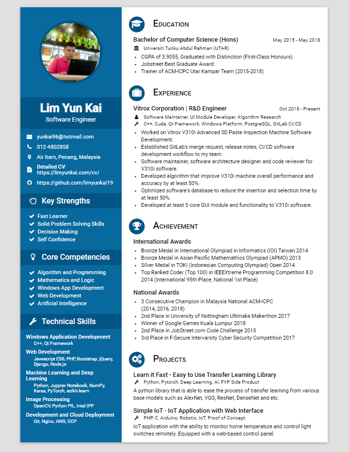

# resume
My resume in pure HTML and CSS. Available at:
 HTML: <https://limyunkai19.github.io/resume/limyunkai_resume.html> (Currently, only works in chrome)
 PDF: <https://limyunkai19.github.io/resume/limyunkai_resume.pdf>

## Browser Support
Works in Chrome Version 68.0.3440.106 (Official Build) (64-bit).

## Acknowledgements
This resume makes use of the following libraries:
 - [Paper CSS](https://github.com/cognitom/paper-css)
 - [normalize.css](https://github.com/necolas/normalize.css/)
 - [Font Awesome](https://github.com/FortAwesome/Font-Awesome)
 - [Roboto - Google Fonts](https://fonts.google.com/specimen/Roboto)
